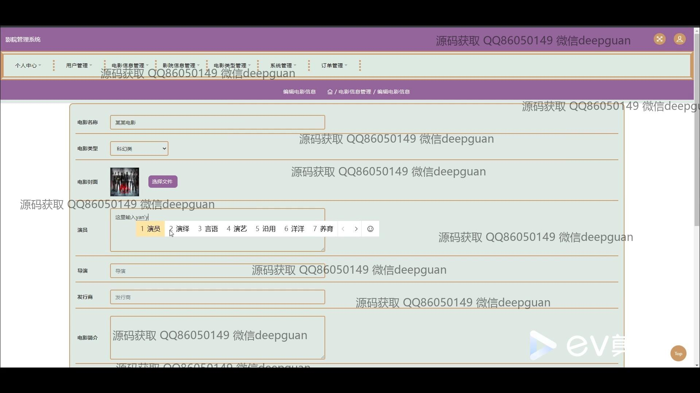

<h1 align="center">影院管理系统的设计与实现+jsp</h1>

## 简介
影院管理系统：角色分为管理员、用户；功能包括电影信息管理、公告信息管理、用户订单管理、个人信息维护等，支持评论互动、座位选择及交易处理，提升观影和运营效率。    --计算机毕业设计源码；毕设源码；java毕业设计源码

## 联系方式

<h3 align="center">获取完整代码与数据库文件 + 微信：deepguan QQ: 86050149 QQ群: 783742310</h3>

<h3 align="center">可帮忙远程部署 包运行成功！提供远程部署、修改代码、设计文档指导、代码讲解等服务！</h3>

## 功能介绍（完整见运行截图）
管理员  
基本功能：登录、注册、退出。  
电影管理：添加、修改、删除电影信息，包括名称、类型、主演、导演、发行商、简介等信息。  
公告管理：发布、查看、修改和删除公告，支持富文本编辑和公告状态管理。  
影院管理：管理影院信息，包括影院名称、地址、座位数、和票价。  
订单管理：查看和管理订单状态，过滤未支付、已支付、已完成等订单。  
系统管理：管理用户权限和系统设置，提高影院运营效率。

用户  
基本功能：登录、注册、退出。  
网站首页：浏览电影信息，包括影片封面、类型、简介等。  
电影预定：查看电影排期和座位布局，选择并预定电影票。  
订单中心：查看历史订单详情，评价已购电影和管理订单状态。  
个人中心：查看和编辑个人信息，包括账号、密码、姓名、邮箱等，以及头像上传和余额查看。

## 运行截图

本代码来源于网络,仅供学习参考使用!

